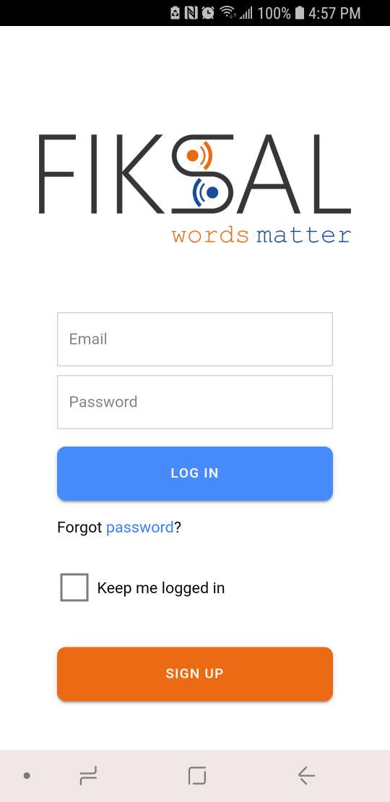
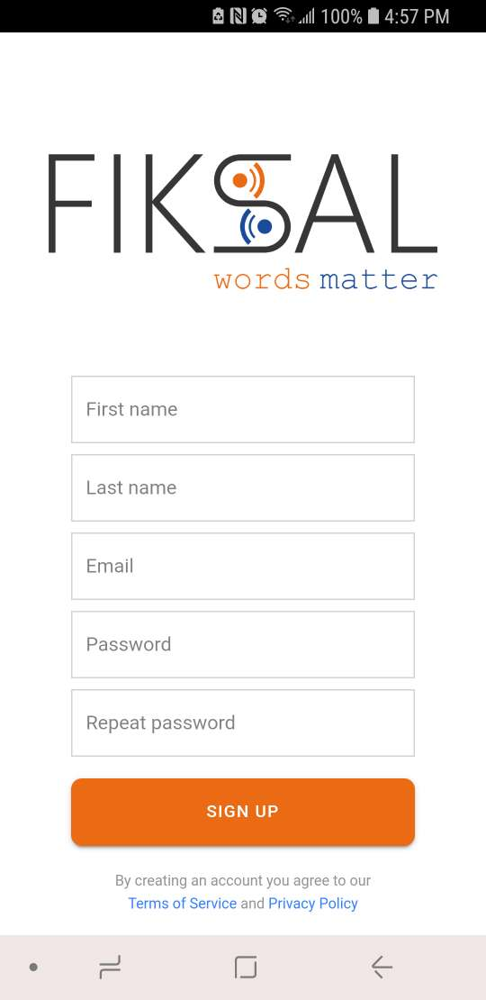
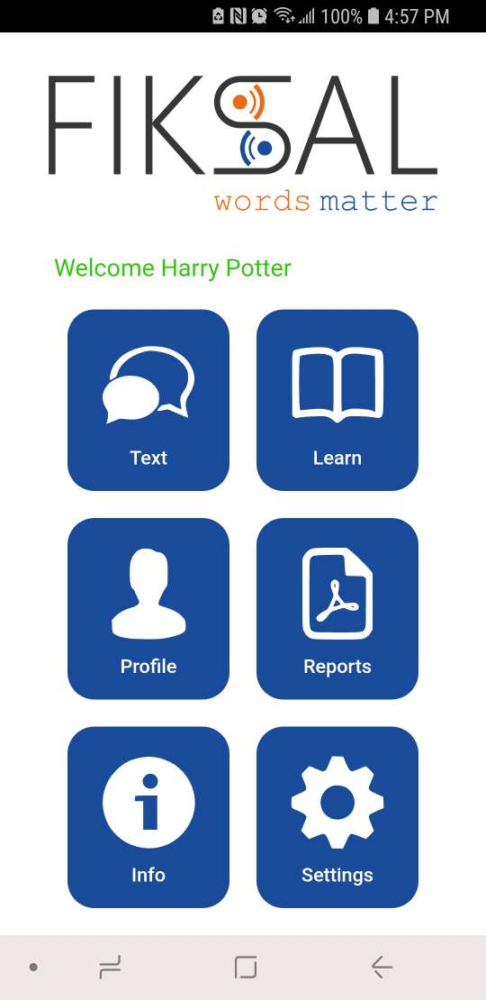

# Fiksal For Ionic

This repository is to test some ui screens with ionic/react in capacitor.
This repository contains 3 screens: Log in, Register, Home.

Taking a photo and taking a video features are tested in this repository.

Here are full versions for Fiksal in [iOS](https://apps.apple.com/us/app/fiksal/id1473240993) & [Android](https://play.google.com/store/apps/details?id=com.fiksal&hl=en_US&gl=US)

Log in | Register | Home
------- | ------- | -----
 |  | 
